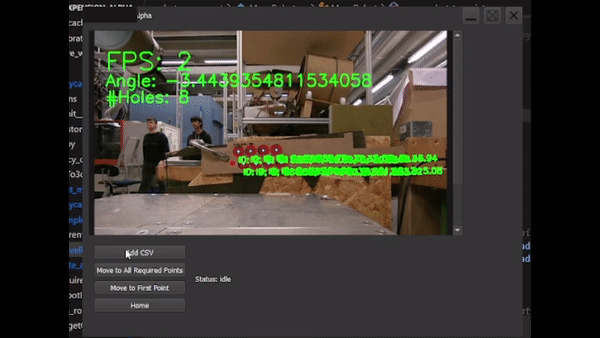

# Tube Expansion

[The project uses computervision to locate the center points of holes in a tube plate, meant for being applied to tube expansion for boilers.
Below are GIFs explaining the basics of the program. The GIFs are from an outdated video and only meant to illustrate the basic principle. They should be updated to reflect the new system.]

## Move the Robot Base to the Tube Plate

## Use the GUI to Save the Points

## The Robot Moves to the Points

